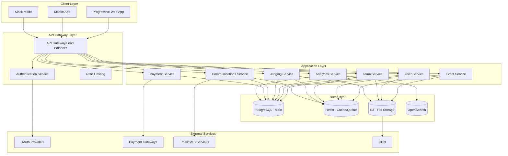
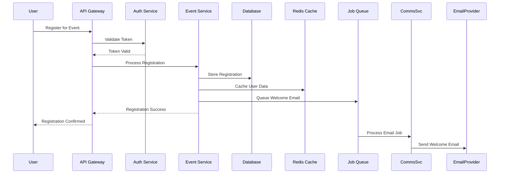

# Design Document

## Overview

HackOps is designed as a modular monolith architecture that can evolve into microservices as the platform scales. The system follows Domain-Driven Design principles with clear bounded contexts for each major functional area. The architecture prioritizes scalability, security, and maintainability while supporting multi-tenancy and real-time features.

The platform serves multiple user types across different event formats (in-person, virtual, hybrid) with role-based access control and comprehensive audit trails. The design emphasizes offline-first capabilities for critical functions like check-ins and supports high-concurrency scenarios during registration surges and judging periods.

## Architecture

### High-Level Architecture



### Technology Stack

**Frontend:**
- Next.js 14+ with React 18+ for the main web application
- Progressive Web App (PWA) capabilities for offline functionality
- Tailwind CSS for styling with custom design system
- WebSocket integration for real-time updates
- Service Workers for offline caching and background sync

**Backend:**
- Python FastAPI for high-performance API development
- SQLAlchemy ORM with Alembic for database migrations
- Celery with Redis for background job processing
- WebSocket support via FastAPI WebSocket
- Pydantic for data validation and serialization

**Database:**
- PostgreSQL 15+ as primary database with JSONB support
- Redis for caching, session storage, and job queues
- OpenSearch for full-text search and analytics
- Connection pooling with pgbouncer

**Infrastructure:**
- Docker containers with multi-stage builds
- Kubernetes for orchestration and scaling
- Nginx as reverse proxy and load balancer
- Prometheus + Grafana for monitoring
- Sentry for error tracking

## Components and Interfaces

### Core Services

#### 1. Identity and Access Management Service
**Responsibilities:**
- User authentication and authorization
- Multi-tenant access control
- OAuth integration
- Session management
- RBAC enforcement

**Key Interfaces:**
```python
class AuthService:
    def authenticate_user(self, credentials: AuthCredentials) -> AuthResult
    def authorize_action(self, user: User, resource: str, action: str) -> bool
    def create_session(self, user: User) -> Session
    def validate_token(self, token: str) -> TokenValidation
    def get_user_permissions(self, user: User, tenant: Tenant) -> List[Permission]
```

#### 2. Event Management Service
**Responsibilities:**
- Event lifecycle management
- Configuration and settings
- Schedule management
- Resource allocation

**Key Interfaces:**
```python
class EventService:
    def create_event(self, event_data: EventCreateRequest) -> Event
    def update_event_config(self, event_id: str, config: EventConfig) -> Event
    def manage_schedule(self, event_id: str, schedule: Schedule) -> ScheduleResult
    def allocate_resources(self, event_id: str, resources: List[Resource]) -> AllocationResult
```

#### 3. Registration Service
**Responsibilities:**
- User registration processing
- Form validation and customization
- Payment processing integration
- Eligibility verification

**Key Interfaces:**
```python
class RegistrationService:
    def process_registration(self, registration: RegistrationData) -> RegistrationResult
    def validate_eligibility(self, user: User, event: Event) -> EligibilityResult
    def handle_payment(self, payment_data: PaymentData) -> PaymentResult
    def generate_ticket(self, registration: Registration) -> Ticket
```

#### 4. Team Management Service
**Responsibilities:**
- Team formation and matching
- Team collaboration features
- Skill-based recommendations
- Team lifecycle management

**Key Interfaces:**
```python
class TeamService:
    def create_team(self, team_data: TeamCreateRequest) -> Team
    def find_teammates(self, user: User, criteria: MatchingCriteria) -> List[User]
    def join_team(self, user: User, team: Team) -> JoinResult
    def manage_team_roles(self, team: Team, role_changes: List[RoleChange]) -> Team
```

#### 5. Submission Management Service
**Responsibilities:**
- Project submission handling
- File upload and storage
- Plagiarism detection
- Submission validation

**Key Interfaces:**
```python
class SubmissionService:
    def create_submission(self, submission_data: SubmissionData) -> Submission
    def upload_files(self, submission_id: str, files: List[File]) -> UploadResult
    def validate_submission(self, submission: Submission) -> ValidationResult
    def detect_plagiarism(self, submission: Submission) -> PlagiarismResult
```

#### 6. Judging Service
**Responsibilities:**
- Judge assignment and management
- Scoring and rubric management
- Score normalization
- Conflict detection

**Key Interfaces:**
```python
class JudgingService:
    def assign_judges(self, event: Event, assignment_config: AssignmentConfig) -> AssignmentResult
    def submit_score(self, judge: User, submission: Submission, scores: Dict[str, float]) -> ScoreResult
    def normalize_scores(self, event: Event) -> NormalizationResult
    def detect_conflicts(self, judge: User, submissions: List[Submission]) -> List[Conflict]
```

### Data Flow Architecture



## Data Models

### Core Entities

#### User Model
```python
class User(BaseModel):
    id: UUID
    tenant_id: UUID
    email: str
    first_name: str
    last_name: str
    auth_provider: str
    profile_data: Dict[str, Any]  # JSONB field
    consent_data: Dict[str, Any]  # JSONB field
    created_at: datetime
    updated_at: datetime
    is_active: bool
    gdpr_consent_at: Optional[datetime]
    minor_flag: bool
```

#### Event Model
```python
class Event(BaseModel):
    id: UUID
    tenant_id: UUID
    name: str
    slug: str
    description: str
    event_type: EventType  # in_person, virtual, hybrid
    timezone: str
    start_at: datetime
    end_at: datetime
    venue_data: Dict[str, Any]  # JSONB field
    capacity: int
    registration_config: Dict[str, Any]  # JSONB field
    status: EventStatus
    created_at: datetime
    updated_at: datetime
```

#### Team Model
```python
class Team(BaseModel):
    id: UUID
    event_id: UUID
    name: str
    captain_id: UUID
    track_id: Optional[UUID]
    size_limit: int
    repository_url: Optional[str]
    status: TeamStatus
    created_at: datetime
    updated_at: datetime
    
class TeamMember(BaseModel):
    id: UUID
    team_id: UUID
    user_id: UUID
    role: TeamRole  # captain, member
    joined_at: datetime
    status: MemberStatus
```

#### Submission Model
```python
class Submission(BaseModel):
    id: UUID
    team_id: UUID
    track_id: UUID
    challenge_ids: List[UUID]
    title: str
    description: str
    repository_url: str
    demo_video_url: Optional[str]
    presentation_url: Optional[str]
    tech_stack: List[str]
    status: SubmissionStatus
    submitted_at: Optional[datetime]
    created_at: datetime
    updated_at: datetime
```

#### Judging Models
```python
class Rubric(BaseModel):
    id: UUID
    event_id: UUID
    name: str
    criteria: List[RubricCriterion]
    total_weight: int
    created_at: datetime

class RubricCriterion(BaseModel):
    key: str
    label: str
    weight: int
    max_score: int
    guidance: str

class Score(BaseModel):
    id: UUID
    submission_id: UUID
    judge_id: UUID
    rubric_id: UUID
    criterion_scores: Dict[str, float]  # JSONB field
    total_score: float
    normalized_score: Optional[float]
    comments: str
    created_at: datetime
    updated_at: datetime
```

### Database Schema Design

The database follows a multi-tenant architecture with tenant isolation at the row level using tenant_id columns. Key design decisions:

1. **JSONB Usage**: Flexible configuration and profile data stored as JSONB for schema evolution
2. **Audit Trails**: All critical tables include created_at, updated_at, and audit logging
3. **Soft Deletes**: Important entities use soft deletion with is_deleted flags
4. **Indexing Strategy**: Composite indexes on tenant_id + frequently queried columns
5. **Partitioning**: Large tables (audit_logs, communications) partitioned by date

## Error Handling

### Error Classification

**System Errors (5xx):**
- Database connection failures
- External service timeouts
- Resource exhaustion
- Internal server errors

**Client Errors (4xx):**
- Authentication failures
- Authorization violations
- Validation errors
- Resource not found
- Rate limiting

**Business Logic Errors:**
- Registration deadline passed
- Team size limits exceeded
- Submission already finalized
- Judge conflict detected

### Error Response Format

```python
class ErrorResponse(BaseModel):
    error_code: str
    message: str
    details: Optional[Dict[str, Any]]
    timestamp: datetime
    request_id: str
    
class ValidationErrorResponse(ErrorResponse):
    field_errors: Dict[str, List[str]]
```

### Retry and Circuit Breaker Patterns

```python
class CircuitBreaker:
    def __init__(self, failure_threshold: int = 5, timeout: int = 60):
        self.failure_threshold = failure_threshold
        self.timeout = timeout
        self.failure_count = 0
        self.last_failure_time = None
        self.state = "CLOSED"  # CLOSED, OPEN, HALF_OPEN
    
    def call(self, func, *args, **kwargs):
        if self.state == "OPEN":
            if time.time() - self.last_failure_time > self.timeout:
                self.state = "HALF_OPEN"
            else:
                raise CircuitBreakerOpenError()
        
        try:
            result = func(*args, **kwargs)
            if self.state == "HALF_OPEN":
                self.state = "CLOSED"
                self.failure_count = 0
            return result
        except Exception as e:
            self.failure_count += 1
            self.last_failure_time = time.time()
            if self.failure_count >= self.failure_threshold:
                self.state = "OPEN"
            raise e
```

## Testing Strategy

### Testing Pyramid

**Unit Tests (70%):**
- Service layer business logic
- Data model validation
- Utility functions
- Algorithm implementations (judge assignment, score normalization)

**Integration Tests (20%):**
- API endpoint testing
- Database integration
- External service mocking
- Authentication flows

**End-to-End Tests (10%):**
- Critical user journeys
- Multi-service workflows
- Performance testing
- Security testing

### Test Data Management

```python
class TestDataFactory:
    @staticmethod
    def create_event(tenant_id: UUID, **overrides) -> Event:
        defaults = {
            "name": "Test Hackathon",
            "event_type": EventType.IN_PERSON,
            "start_at": datetime.now() + timedelta(days=30),
            "end_at": datetime.now() + timedelta(days=32),
            "capacity": 100
        }
        return Event(tenant_id=tenant_id, **{**defaults, **overrides})
    
    @staticmethod
    def create_user(tenant_id: UUID, **overrides) -> User:
        defaults = {
            "email": f"test{uuid4()}@example.com",
            "first_name": "Test",
            "last_name": "User",
            "auth_provider": "google"
        }
        return User(tenant_id=tenant_id, **{**defaults, **overrides})
```

### Performance Testing

**Load Testing Scenarios:**
- Registration surge: 1000 concurrent registrations
- Judging crunch: 500 judges scoring 2000 submissions
- Real-time updates: 5000 concurrent WebSocket connections
- File uploads: 100 concurrent large file uploads

**Performance Targets:**
- API response time: <200ms P95
- Database query time: <50ms P95
- File upload: <30s for 100MB files
- WebSocket message delivery: <300ms P95

### Security Testing

**Authentication Testing:**
- OAuth flow validation
- Token expiration handling
- Session management
- Multi-factor authentication

**Authorization Testing:**
- Role-based access control
- Tenant isolation
- Resource-level permissions
- Privilege escalation prevention

**Data Protection Testing:**
- PII encryption validation
- GDPR compliance verification
- Audit trail completeness
- Data retention policy enforcement